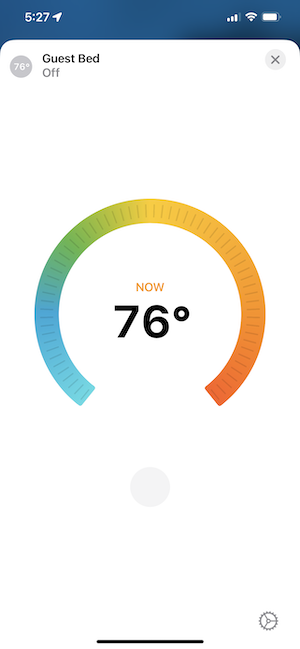
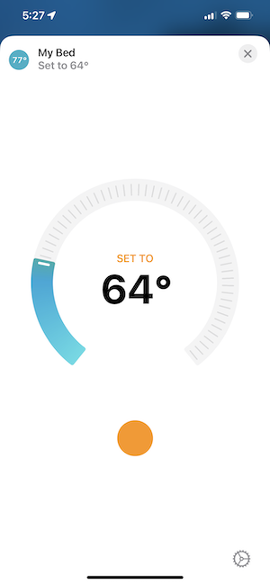
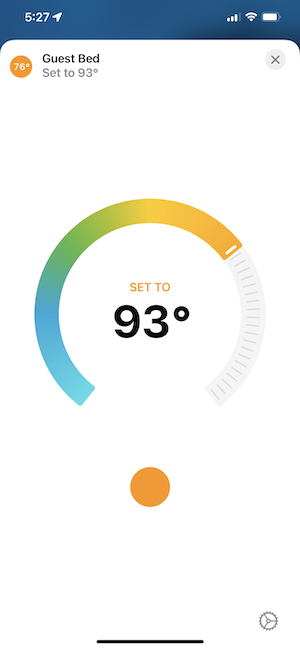

# Homebridge Eight Sleep Thermostat

This plugin adds Homekit support for the Eight Sleep Pod smart mattress via Homebridge. Installing this plugin will either add a thermostat 
accessory control for each side of the bed (left & right), or a single thermostat control if you're using the bed as solo. This will be 
automatically determined based on your current settings in the Eight Sleep app.

## About This Plugin

This plugin is currently in beta, and at the moment uses real temperature units °C/°F. If you don't have the 'Use Real Temperatures' setting
enabled in your Eight Sleep app, you'll need to do so if you want consistency between the app and this plugin. To enable this option in the 
app, you need to be an Eight Sleep labs member. Keep in mind, you don't need to have the option enabled for this plugin to work, but without
it, it'll be tricky to know what temperature to set your bed at. That said, you can always just use this plugin as a simple off/off switch
for your bed without needing to adjust the temperature settings.

I plan to bring support for the standard Eight Sleep bed level settings (-10/+10) in the near future.

## Getting Started

To start using this plugin, you'll need to update the config settings in Homebridge UI or manually by adding the required fields to your
Homebridge `config.json` file. Whichever method you choose, at a minimum you need to add your Eight Sleep account login email & password. 
You can optionally set a name for how the accessories will appear in Homekit. (Note: if you're unfamiliar with Homebridge, you must have the 
platform field in the configuration file set to "EightSleepThermostat"). See the included configuration screenshots if you need help.

### Setup via Homebridge UI:

### Manual setup via `config.json`:

### Displayed in HomeKit:

  
   
  

